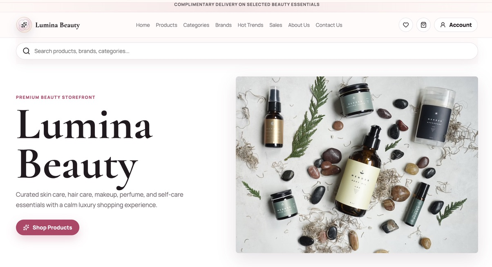
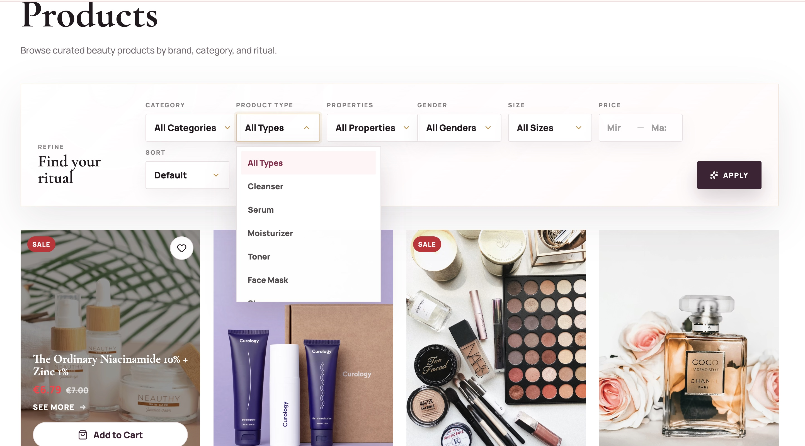
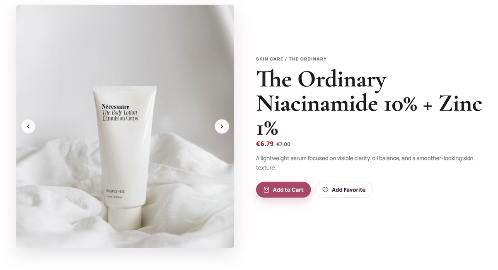
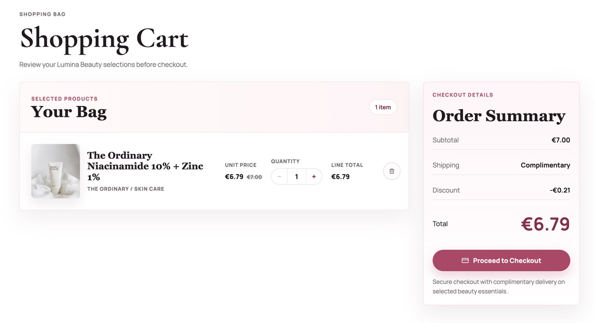
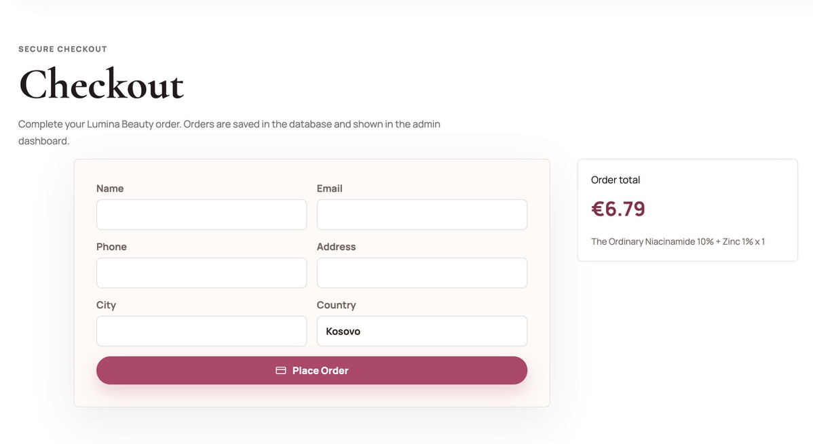
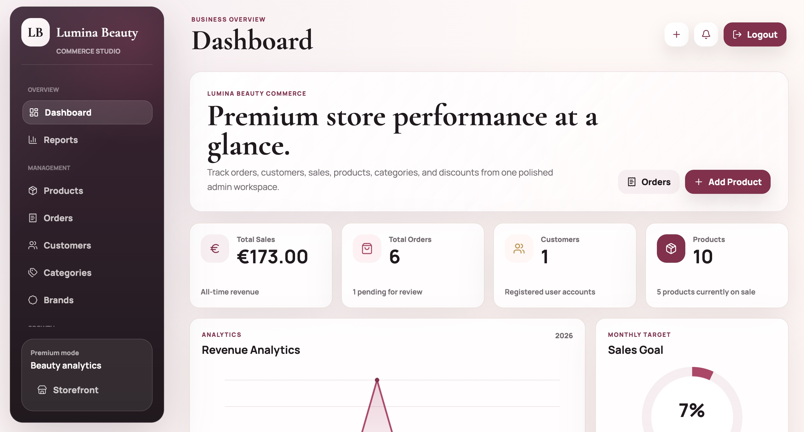
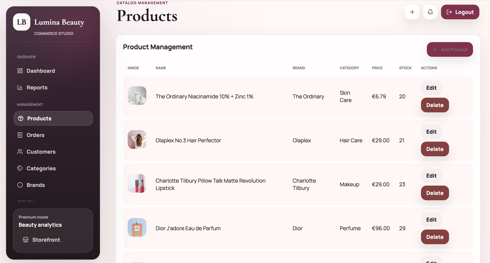
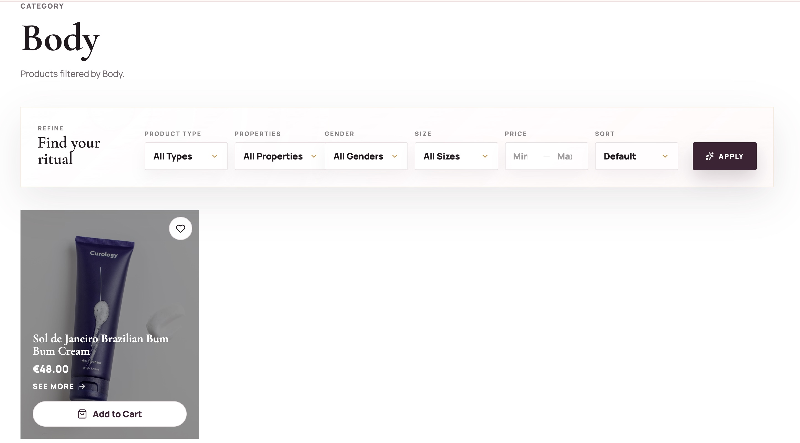
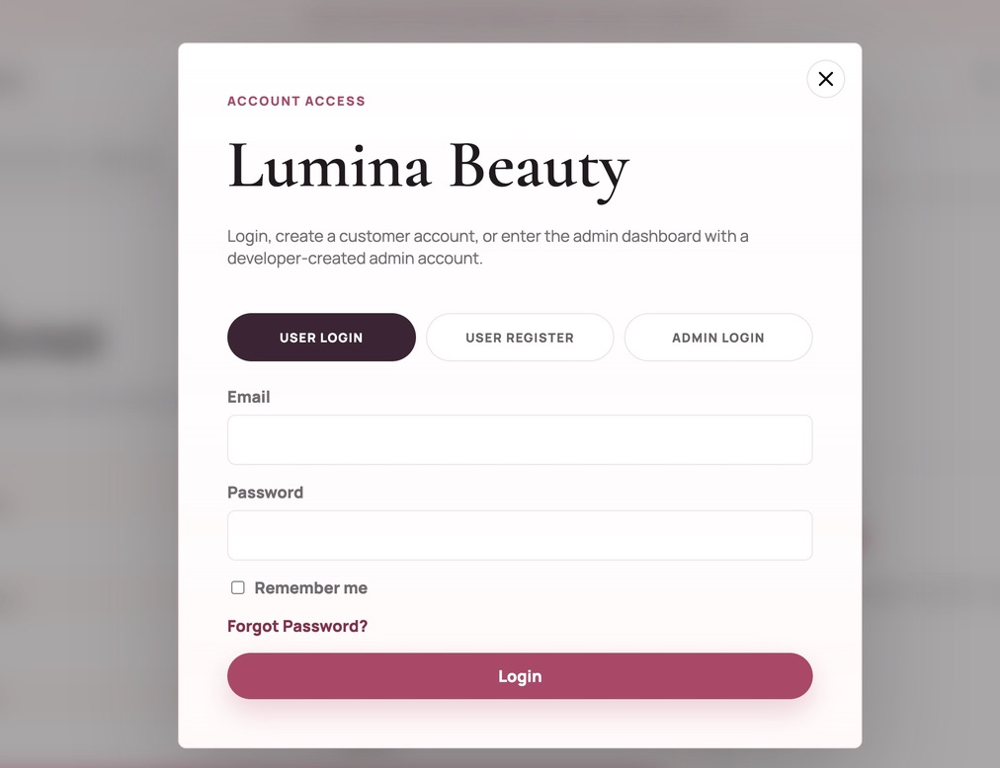

# 💄 Lumina Beauty

A full-stack e-commerce platform for cosmetic products developed as my Bachelor's Thesis in Computer Science (Software Engineering).

## 🚀 Overview

Lumina Beauty is a Laravel-based e-commerce application designed to simulate a modern online cosmetics store. The project includes both customer-facing features and an administrative dashboard for managing products, categories, brands, orders, and users.

## ✨ Features

- User Authentication & Authorization
- Admin Dashboard
- Product Management (CRUD)
- Category Management
- Brand Management
- Shopping Cart
- Favorites (Wishlist)
- Product Filtering
- Checkout System
- Order Management
- Email Notifications (Mailpit)

## 🛠️ Technologies

- Laravel
- PHP
- Blade
- JavaScript
- HTML5
- CSS3
- MariaDB / MySQL
- Docker
- DDEV
- Mailpit

## 📸 Screenshots

### Home Page



### Products



### Product Details



### Shopping Cart



### Checkout



### Admin Dashboard



### Product Management



### Categories



### Login



## ⚙️ Installation

```bash
git clone https://github.com/vesaaas/lumina-beauty.git

cd lumina-beauty

composer install
npm install

cp .env.example .env
php artisan key:generate

ddev start

php artisan migrate --seed

npm run dev
```

## 🎓 Project Purpose

This application was developed as my Bachelor's Thesis in Computer Science (Software Engineering). The goal was to design and implement a complete full-stack e-commerce platform using Laravel while following modern software engineering principles, the MVC architecture, and best development practices.

## 🔮 Future Improvements

- Payment gateway integration (Stripe / PayPal)
- Product reviews and ratings
- Order tracking
- Stock reservation during checkout
- Sales analytics dashboard
- Product recommendations

## 👨‍💻 Author

**Vesa Sogojeva**

- GitHub: [@vesaaas](https://github.com/vesaaas)
- LinkedIn: [Vesa Sogojeva](https://www.linkedin.com/in/vesa-sogojeva-49930a1b8/)
