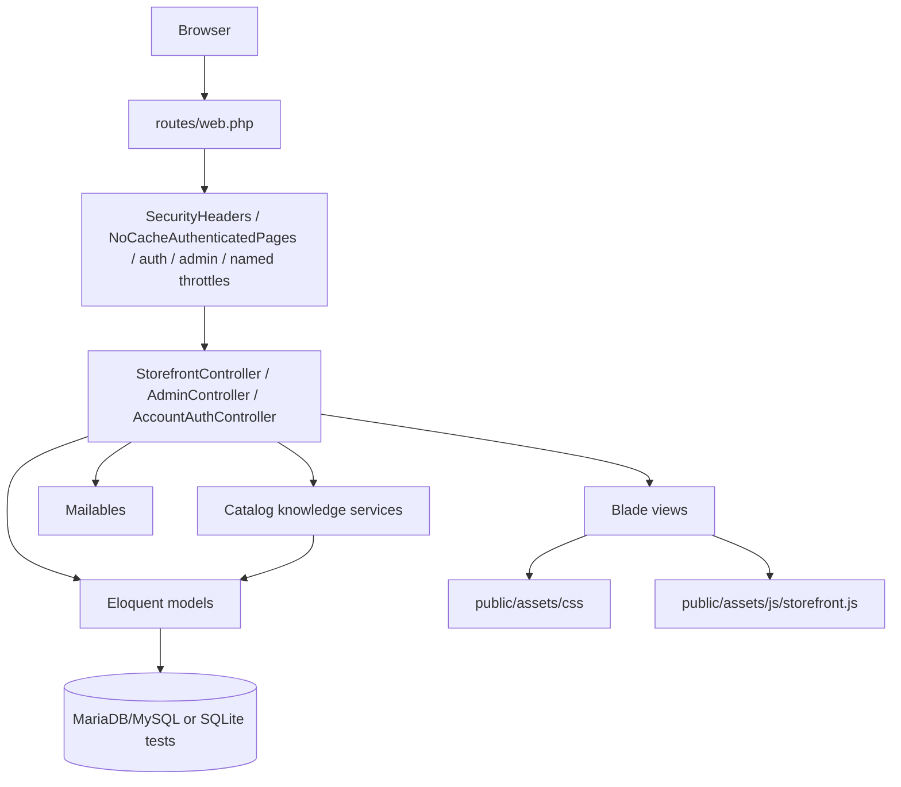

# Architecture

## Current Architecture

Lumina Beauty is a traditional Laravel 13 monolithic MVC application.

## Request Lifecycle

1. Browser requests a route from `routes/web.php`.
2. Laravel applies web middleware, appended `SecurityHeaders` and `NoCacheAuthenticatedPages`, and route middleware such as `auth`, `guest`, named `throttle`, and `admin`.
3. Slug route model binding resolves products, categories, and brands through `getRouteKeyName()`.
4. Controllers validate input, query Eloquent models, perform business operations, send mail, and return Blade views or redirects.
5. Blade renders HTML using layouts, components, static CSS, and static JS.

## Routing

All browser routes are in `routes/web.php`.

- Public storefront routes serve home, products, categories, brands, favorites, cart, checkout, content pages, sales, and hot trends.
- Custom auth routes handle account modal redirects, login, login 2FA, register, logout, password reset, admin login, admin login 2FA, Google OAuth, and email OTP verification.
- Admin routes are grouped under `/admin`, named `admin.*`, and protected by `auth` plus `admin` middleware.

## Middleware

- `app/Http/Middleware/SecurityHeaders.php` appends common security headers, configurable CSP, and production HTTPS-only HSTS.
- `app/Http/Middleware/NoCacheAuthenticatedPages.php` appends no-store/no-cache/private headers to authenticated and auth-challenge responses.
- `app/Http/Middleware/EnsureUserIsAdmin.php` aborts non-admin users with 403.
- `bootstrap/app.php` registers middleware aliases and redirects guests trying to reach admin routes to `admin.login`.
- `AppServiceProvider` registers `OrderPolicy` and named Laravel rate limiters for auth, OTP, contact, and about flows.

## Controllers

- `StorefrontController` handles catalog browsing, filters, favorites, cart, checkout, order thank-you page, content pages, and storefront email messages.
- `AdminController` handles admin dashboard, product/category/brand management, orders, users, reports, discounts, settings, audit logging calls, image upload, and order status mail.
- `AccountAuthController` handles custom customer/admin password entry, registration, password reset, logout, and starts email verification/login 2FA flows.
- `EmailVerificationOtpController` handles account email verification OTP screens, verify, and resend.
- `LoginTwoFactorController` handles customer/admin login 2FA challenge screens, verify, and resend.
- `GoogleAuthController` handles customer-only Google OAuth redirect/callback and missing-credential graceful failure.

Business logic still lives mainly in controllers. Auth, catalog knowledge, and shared-view concerns use focused services where security, deterministic retrieval, or reuse requires them.

## Services

- `AuditLogService` writes audit events to `audit_logs`.
- `EmailVerificationOtpService` generates a random six-digit code, stores only a hash, tracks expiry/attempt metadata, and sends `EmailVerificationOtpMail`.
- `LoginTwoFactorService` manages hashed email login 2FA challenges for customer/admin password login.
- `GuestCheckoutOtpService` manages hashed guest checkout email OTP challenges before order creation.
- `GuestCommerceService` merges guest cart/favorite state into a customer account only after registration or successful customer login 2FA/OAuth.
- `StorefrontViewData` provides common storefront layout data through a view composer and storefront controller helper.
- `ProductKnowledgeService` builds active-by-default Eloquent retrieval for structured catalog knowledge filters.
- `ProductRecommendationService` provides deterministic rule-based recommendations from explicit product knowledge facts only.
- `ProductComparisonService` returns customer-safe structured comparison data for active products.
- `SkincareRoutineService` builds deterministic skincare routines from active, in-stock Skin Care products ordered by the configured skincare routine steps.

## Models And Eloquent

Models in `app/Models` represent users, catalog data, cart/favorite state, orders, order items, audit logs, and OTP rows. Products, categories, and brands use slug route keys. Products use soft deletes and block force deletion.

`Product` also owns Phase 2 Product Knowledge casts, scopes, normalization, active price calculation, and `toKnowledgeArray()` for safe structured product context. Allowed vocabulary lives in `App\Support\Catalog\ProductKnowledge`.

See [DATABASE.md](DATABASE.md) for schema and relationships.

## Blade, JavaScript, And CSS

The UI is server-rendered Blade under `resources/views`. Active CSS/JS are:

- `public/assets/css/styles.css`
- `public/assets/css/admin.css`
- `public/assets/js/storefront.js`

Vite/Tailwind files exist but are not the active linked assets in the visible layouts. See [FRONTEND.md](FRONTEND.md).

## Database

DDEV uses MariaDB 10.11. Tests use in-memory SQLite from `phpunit.xml`. Migrations are the schema source of truth.

Product Knowledge uses additive `products` columns rather than a separate search service: JSON arrays for controlled multi-value tags, scalar columns for exact-match usage fields, and nullable booleans for tri-state factual attributes. `null` means unknown/not documented; JSON `[]` means known empty/not applicable/intentionally cleared.

## Mail

Mailables handle order status, storefront page messages, account email OTP verification, login 2FA codes, and guest checkout OTP codes. Laravel runtime mail is documented for Gmail SMTP through environment variables. Mailpit may exist as a DDEV utility but is not the documented runtime mail transport.

See [EMAIL_INTEGRATIONS.md](EMAIL_INTEGRATIONS.md).

## DDEV Infrastructure

`.ddev/config.yaml` defines a Laravel project named `lumina-beauty` with docroot `public`, nginx-fpm, PHP 8.4, MariaDB 10.11, and Node.js 22.

## Commerce State

Guests use session-backed cart data and session-owned favorites. Authenticated users use `cart_items` and `favorites` rows. On login/register, guest cart/favorite state is merged into the authenticated user's persisted state.

## Admin Boundary

Admin access is controlled by the same `users` table with an `is_admin` boolean. There is no role/permission package. The intended architecture is a single developer-created admin account.

See [ADMIN_PANEL.md](ADMIN_PANEL.md) and [adr/002-single-administrator-model.md](adr/002-single-administrator-model.md).

## Checkout Transaction Boundary

`StorefrontController::placeOrder()` wraps order creation, item creation, stock checks, product row locks, stock decrement, and cart cleanup in a database transaction. Authenticated verified customers proceed directly. Guests first complete a session-scoped checkout email OTP challenge; the pending order email is sent after the transaction completes.

## Authorization Boundary

`OrderPolicy` protects authenticated order visibility. Guest order confirmation access is session-bound to the checkout session that created the order. Admin routes remain protected by `auth` plus `admin` middleware rather than resource policies that would only duplicate the admin boolean check.

## Potential Future Refactoring

Future refactoring may move checkout, cart, favorites, filtering, and admin validation into dedicated actions/services/form requests. Phase 3 AI chatbot work is planned but not implemented; there is no React chatbot UI, Python/FastAPI service, OpenAI integration, embeddings, vector database, or chatbot route/controller in the current architecture.
