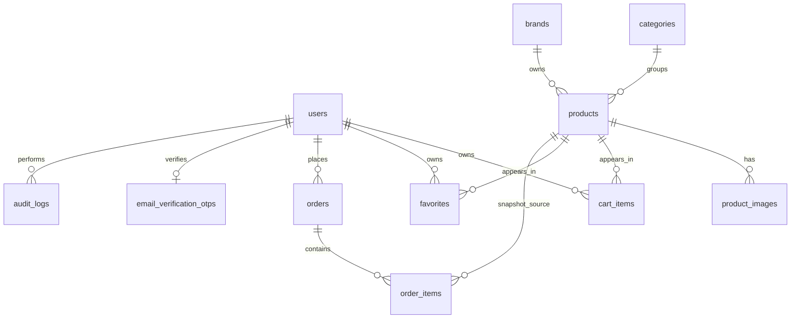

# Database

Migrations are the database source of truth. See [ARCHITECTURE.md](ARCHITECTURE.md) for application flow and [COMMERCE_ORDERS.md](COMMERCE_ORDERS.md) for order behavior.

## ER Overview

## Core Tables

### `users`

Purpose: customer and admin identity.

Key columns: `id`, `name`, `email` unique, `phone` nullable, `email_verified_at` nullable, `password`, `is_admin`, `remember_token`, timestamps.

Relationships: has many cart items, favorites, orders, audit logs; has one email verification OTP.

Deletion behavior: user deletion cascades cart/favorite rows, nulls `orders.user_id`, nulls `audit_logs.user_id`, and cascades OTP rows.

### `password_reset_tokens`

Purpose: Laravel password reset broker storage.

Key columns: `email` primary key, `token`, `created_at`.

Security note: reset tokens must never be logged or documented.

### `sessions`

Purpose: Laravel database session storage when configured.

Key columns: `id` primary, `user_id` indexed nullable, `ip_address`, `user_agent`, `payload`, `last_activity` indexed.

### `categories`

Purpose: catalog grouping.

Key columns: `id`, `name`, `slug` unique, `description`, `image`, timestamps.

Relationships: has many products.

Deletion behavior: original product FK is cascade from products to categories, but admin code blocks category deletion when products exist. Preserve this application-level restriction.

### `brands`

Purpose: product brand grouping.

Key columns: `id`, `name`, `slug` unique, `description`, `image`, timestamps.

Relationships: has many products.

Deletion behavior: original product FK is cascade from products to brands, but admin code blocks brand deletion when products exist and requires current password. Preserve this application-level restriction.

### `products`

Purpose: sellable catalog products.

Key columns: `category_id`, `brand_id`, `name`, `slug` unique, `description`, `product_type`, `properties` JSON nullable, `gender`, `size`, `price`, `sale_price`, `stock` unsigned, `is_featured`, `is_new_arrival`, `is_hot_trend`, `is_active`, `deleted_at`, timestamps.

Relationships: belongs to category/brand; has many images and order items.

Deletion behavior: products use soft deletes. `Product::booted()` throws on force delete. There is no admin product delete route. Never reintroduce physical product deletion.

Integrity rules:

- `stock` is unsigned in schema and must not become negative.
- Purchase checks must enforce active product and sufficient stock server-side.
- Product deletion must preserve order history.

### `product_images`

Purpose: product gallery.

Key columns: `product_id`, `path`, `alt_text`, `sort_order`, timestamps.

Relationships: belongs to product.

Deletion behavior: cascades when product is deleted at the database level; product physical deletion is blocked in application code.

### `favorites`

Purpose: wishlist/favorite product state for guests and authenticated users.

Key columns: `user_id` nullable, `session_id` nullable indexed, `product_id`, timestamps.

Constraints: unique `user_id + product_id`; unique `session_id + product_id`.

Deletion behavior: cascades on user/product physical deletion. Product physical deletion is blocked.

### `cart_items`

Purpose: authenticated cart rows and session-owned cart rows.

Key columns: `user_id` nullable, `session_id` nullable indexed, `product_id`, `quantity` unsigned default 1, timestamps.

Constraints: unique `user_id + product_id`; unique `session_id + product_id`.

Deletion behavior: cascades on user/product physical deletion. Product physical deletion is blocked.

### `orders`

Purpose: persisted customer orders.

Key columns: `user_id` nullable, `order_number` unique, customer/shipping fields, `status`, `subtotal`, `discount_total`, `total`, timestamps.

Relationships: belongs to user; has many order items.

Deletion behavior: `user_id` is set null if the user is deleted. Preserve order records and customer-entered order fields.

### `order_items`

Purpose: immutable-ish line item history for orders.

Key columns: `order_id`, `product_id` nullable, `product_name`, `brand_name`, `category_name`, `unit_price`, `quantity`, `line_total`, timestamps.

Deletion behavior: order deletion cascades order items. Product deletion is restricted after `2026_07_03_000001_protect_products_from_physical_deletion.php`.

Integrity rule: product, brand, category, and price snapshots are stored to preserve order history even if catalog data changes later.

### `audit_logs`

Purpose: selected admin/security action audit trail.

Key columns: `user_id` nullable, `action`, nullable morph `auditable_type/auditable_id`, `old_values` JSON, `new_values` JSON, `ip_address`, `user_agent`, `created_at`.

Indexes: `action + created_at`, morph indexes from `nullableMorphs`.

Security rule: never write passwords, reset tokens, OTP codes, OAuth secrets, 2FA secrets, or equivalent authentication secrets to audit logs.

### `email_verification_otps`

Purpose: in-progress customer email verification flow.

Key columns: `user_id` unique, `code_hash`, `expires_at`, `attempts`, `last_sent_at`, timestamps.

Deletion behavior: cascades when user is deleted.

Security rule: store only hashed codes. Never log or document OTP plaintext codes.

## Laravel System Tables

- `cache`, `cache_locks`: Laravel cache storage.
- `jobs`, `job_batches`, `failed_jobs`: queue infrastructure tables. Current mail sends are synchronous; production queue worker is planned.

## Critical Integrity Rules

- Product deletion must remain soft/logical; force deletion must remain blocked.
- Order item snapshots must continue to preserve historical commerce data.
- Checkout must not allow negative inventory.
- Category and brand deletion should remain blocked while products reference them.
- User deletion must not destroy order history.
